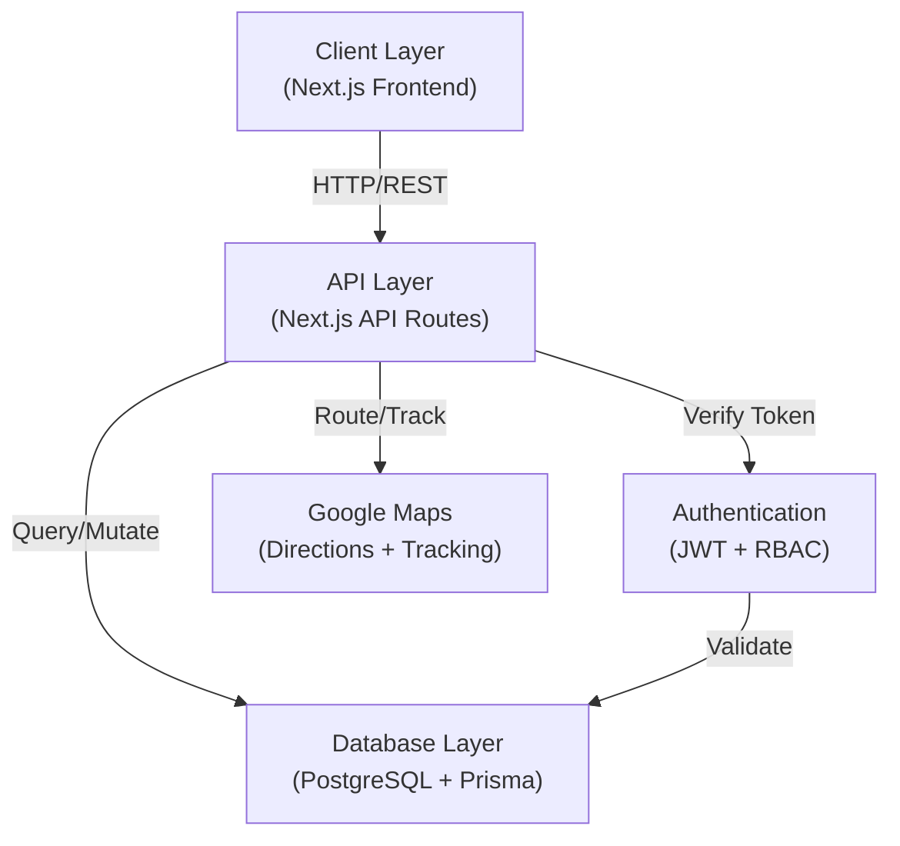
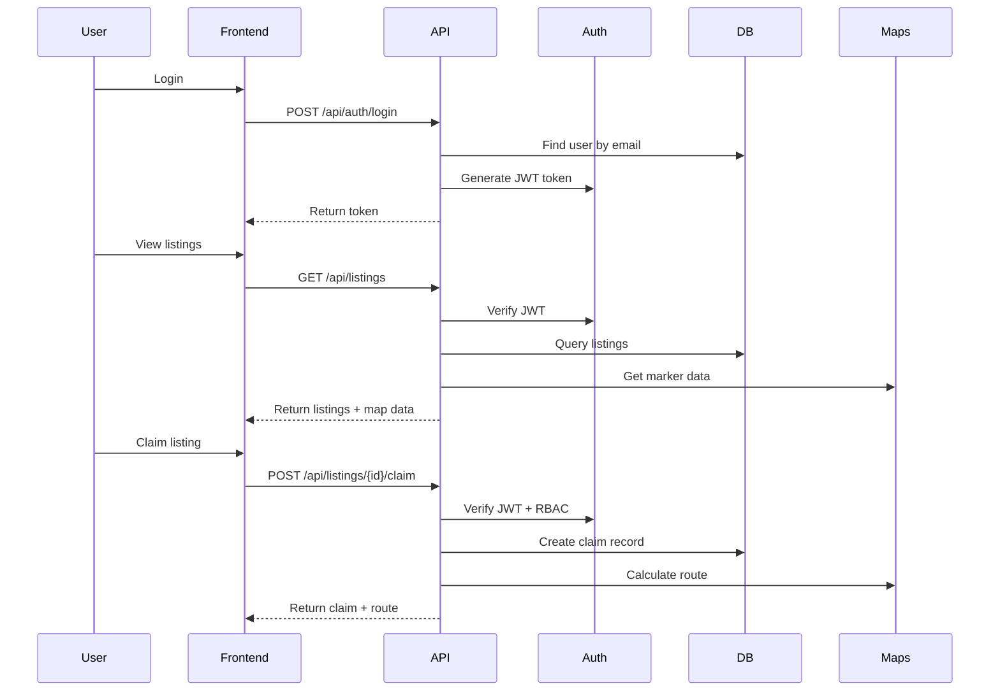

# FoodFlow Production Upgrade Specification

## Overview

This specification outlines the complete production upgrade for FoodFlow, transitioning from mock data to a production-ready system with PostgreSQL database, Prisma ORM, JWT authentication, role-based access control, and advanced Google Maps integration with real-time delivery tracking.

The upgrade is structured in three phases:
- **Phase 1**: Database setup with Prisma schema and migrations
- **Phase 2**: Backend API implementation with authentication and RBAC
- **Phase 3**: Advanced Google Maps integration with real-time tracking

## System Architecture



## Data Flow




---

# PHASE 1: PostgreSQL + Prisma Setup

## Database Schema Design

### Core Models and Relationships

```prisma
// User model - Base for all user types
model User {
  id            String    @id @default(cuid())
  email         String    @unique
  passwordHash  String
  name          String
  role          Role      @default(DONOR)
  status        UserStatus @default(ACTIVE)
  avatar        String?
  createdAt     DateTime  @default(now())
  updatedAt     DateTime  @updatedAt
  
  // Relations
  donorProfile  Donor?
  ngoProfile    NGO?
  adminProfile  Admin?
  deliveries    Delivery[]
  
  @@index([email])
  @@index([role])
}

enum Role {
  DONOR
  NGO
  ADMIN
}

enum UserStatus {
  ACTIVE
  SUSPENDED
  VERIFIED
  PENDING
}

// Donor profile
model Donor {
  id            String    @id @default(cuid())
  userId        String    @unique
  user          User      @relation(fields: [userId], references: [id], onDelete: Cascade)
  businessName  String
  businessType  String    // Bakery, Restaurant, Grocery, etc.
  phone         String?
  address       String
  latitude      Float
  longitude     Float
  rating        Float     @default(0)
  totalDonated  Int       @default(0)
  createdAt     DateTime  @default(now())
  updatedAt     DateTime  @updatedAt
  
  // Relations
  listings      FoodListing[]
  
  @@index([userId])
}

// NGO profile
model NGO {
  id            String    @id @default(cuid())
  userId        String    @unique
  user          User      @relation(fields: [userId], references: [id], onDelete: Cascade)
  organizationName String
  phone         String?
  address       String
  latitude      Float
  longitude     Float
  storageCapacity Int    // in kg
  currentStorage  Int    @default(0)
  rating        Float     @default(0)
  totalReceived Int       @default(0)
  peopleServed  Int       @default(0)
  createdAt     DateTime  @default(now())
  updatedAt     DateTime  @updatedAt
  
  // Relations
  claims        Claim[]
  deliveries    Delivery[]
  
  @@index([userId])
}

// Admin profile
model Admin {
  id            String    @id @default(cuid())
  userId        String    @unique
  user          User      @relation(fields: [userId], references: [id], onDelete: Cascade)
  permissions   String[]  // JSON array of permission strings
  createdAt     DateTime  @default(now())
  updatedAt     DateTime  @updatedAt
  
  @@index([userId])
}

// Food listing
model FoodListing {
  id            String    @id @default(cuid())
  donorId       String
  donor         Donor     @relation(fields: [donorId], references: [id], onDelete: Cascade)
  name          String
  description   String
  category      String    // Bakery, Produce, Prepared Food, Dairy, etc.
  quantity      String    // "50 items", "30 kg", etc.
  quantityValue Float     // Numeric value for calculations
  quantityUnit  String    // items, kg, lbs, servings, etc.
  location      String
  address       String
  latitude      Float
  longitude     Float
  expiryTime    DateTime
  pickupWindow  String?
  imageUrl      String?
  status        ListingStatus @default(AVAILABLE)
  createdAt     DateTime  @default(now())
  updatedAt     DateTime  @updatedAt
  
  // Relations
  claims        Claim[]
  
  @@index([donorId])
  @@index([status])
  @@index([expiryTime])
  @@index([latitude, longitude])
}

enum ListingStatus {
  AVAILABLE
  CLAIMED
  EXPIRED
  CANCELLED
}

// Claim record
model Claim {
  id            String    @id @default(cuid())
  listingId     String
  listing       FoodListing @relation(fields: [listingId], references: [id], onDelete: Cascade)
  ngoId         String
  ngo           NGO       @relation(fields: [ngoId], references: [id], onDelete: Cascade)
  status        ClaimStatus @default(CLAIMED)
  claimedAt     DateTime  @default(now())
  pickupTime    DateTime?
  completedAt   DateTime?
  notes         String?
  
  // Relations
  delivery      Delivery?
  
  @@unique([listingId, ngoId])
  @@index([ngoId])
  @@index([status])
}

enum ClaimStatus {
  CLAIMED
  PICKUP_SCHEDULED
  PICKED_UP
  COMPLETED
  CANCELLED
}

// Delivery tracking
model Delivery {
  id            String    @id @default(cuid())
  claimId       String    @unique
  claim         Claim     @relation(fields: [claimId], references: [id], onDelete: Cascade)
  driverId      String
  driver        User      @relation(fields: [driverId], references: [id])
  ngoId         String
  ngo           NGO       @relation(fields: [ngoId], references: [id])
  status        DeliveryStatus @default(PENDING)
  pickupLat     Float?
  pickupLng     Float?
  deliveryLat   Float?
  deliveryLng   Float?
  route         String?   // JSON encoded route from Google Directions API
  estimatedTime Int?      // in minutes
  actualTime    Int?      // in minutes
  startedAt     DateTime?
  completedAt   DateTime?
  lastLocationUpdate DateTime?
  createdAt     DateTime  @default(now())
  updatedAt     DateTime  @updatedAt
  
  // Relations
  locationUpdates LocationUpdate[]
  
  @@index([driverId])
  @@index([ngoId])
  @@index([status])
}

enum DeliveryStatus {
  PENDING
  IN_TRANSIT
  ARRIVED
  COMPLETED
  CANCELLED
}

// Real-time location tracking
model LocationUpdate {
  id            String    @id @default(cuid())
  deliveryId    String
  delivery      Delivery  @relation(fields: [deliveryId], references: [id], onDelete: Cascade)
  latitude      Float
  longitude     Float
  accuracy      Float?
  timestamp     DateTime  @default(now())
  
  @@index([deliveryId])
  @@index([timestamp])
}
```

## Migration Strategy

### Step 1: Create Prisma Configuration
- Initialize Prisma with PostgreSQL
- Configure `.env` with database URL
- Set up connection pooling for production

### Step 2: Generate Initial Migration
```bash
npx prisma migrate dev --name init
```

### Step 3: Seed Database (Optional)
- Create seed script to populate initial admin users
- Add test data for development environment

### Step 4: Production Deployment
```bash
npx prisma migrate deploy
```

---

# PHASE 2: Backend APIs (Next.js API Routes)

## Authentication System

### JWT Token Structure

```typescript
interface JWTPayload {
  userId: string
  email: string
  role: 'DONOR' | 'NGO' | 'ADMIN'
  iat: number
  exp: number
}
```

### Authentication Endpoints

#### POST /api/auth/register
**Request:**
```json
{
  "email": "user@example.com",
  "password": "securePassword123",
  "name": "John Doe",
  "role": "donor|ngo|admin",
  "businessName": "Business Name",
  "businessType": "Bakery|Restaurant|Grocery|etc",
  "address": "123 Main St, City, State",
  "latitude": 40.7128,
  "longitude": -74.0060,
  "phone": "+1234567890"
}
```

**Response (201):**
```json
{
  "user": {
    "id": "user_123",
    "email": "user@example.com",
    "name": "John Doe",
    "role": "donor"
  },
  "token": "eyJhbGciOiJIUzI1NiIs...",
  "refreshToken": "eyJhbGciOiJIUzI1NiIs..."
}
```

**Error (400):**
```json
{
  "error": {
    "code": "VALIDATION_ERROR",
    "message": "Email already exists"
  }
}
```

#### POST /api/auth/login
**Request:**
```json
{
  "email": "user@example.com",
  "password": "securePassword123"
}
```

**Response (200):**
```json
{
  "user": {
    "id": "user_123",
    "email": "user@example.com",
    "name": "John Doe",
    "role": "donor"
  },
  "token": "eyJhbGciOiJIUzI1NiIs...",
  "refreshToken": "eyJhbGciOiJIUzI1NiIs..."
}
```

**Error (401):**
```json
{
  "error": {
    "code": "INVALID_CREDENTIALS",
    "message": "Invalid email or password"
  }
}
```

#### POST /api/auth/refresh
**Request:**
```json
{
  "refreshToken": "eyJhbGciOiJIUzI1NiIs..."
}
```

**Response (200):**
```json
{
  "token": "eyJhbGciOiJIUzI1NiIs..."
}
```

### Role-Based Access Control (RBAC)

```typescript
interface RBACPolicy {
  DONOR: {
    canCreate: ['listings'],
    canRead: ['own_listings', 'own_profile', 'public_listings'],
    canUpdate: ['own_listings', 'own_profile'],
    canDelete: ['own_listings']
  },
  NGO: {
    canCreate: ['claims'],
    canRead: ['listings', 'own_claims', 'own_profile', 'nearby_listings'],
    canUpdate: ['own_claims', 'own_profile'],
    canDelete: ['own_claims']
  },
  ADMIN: {
    canCreate: ['users', 'listings', 'claims'],
    canRead: ['all_users', 'all_listings', 'all_claims', 'analytics'],
    canUpdate: ['all_users', 'all_listings', 'all_claims'],
    canDelete: ['all_users', 'all_listings', 'all_claims']
  }
}
```

## Listing Endpoints

#### POST /api/listings
**Authentication:** Required (DONOR role)

**Request:**
```json
{
  "name": "Fresh Bakery Items",
  "description": "Fresh bread, croissants, and pastries",
  "category": "Bakery",
  "quantity": "50",
  "quantityUnit": "items",
  "location": "Downtown Bakery",
  "address": "123 Main St, Manhattan",
  "latitude": 40.7128,
  "longitude": -74.0060,
  "expiryTime": "2024-01-20T18:00:00Z",
  "pickupWindow": "4:00 PM - 6:00 PM",
  "imageUrl": "https://..."
}
```

**Response (201):**
```json
{
  "id": "listing_123",
  "donorId": "donor_456",
  "name": "Fresh Bakery Items",
  "status": "AVAILABLE",
  "createdAt": "2024-01-20T12:00:00Z"
}
```

#### GET /api/listings
**Authentication:** Required

**Query Parameters:**
- `status`: AVAILABLE|CLAIMED|EXPIRED|CANCELLED
- `category`: Bakery|Produce|Prepared Food|Dairy|etc
- `lat`: latitude (for nearby search)
- `lng`: longitude (for nearby search)
- `radius`: search radius in km (default: 5)
- `page`: pagination (default: 1)
- `limit`: items per page (default: 20)

**Response (200):**
```json
{
  "listings": [
    {
      "id": "listing_123",
      "name": "Fresh Bakery Items",
      "quantity": "50 items",
      "location": "Downtown Bakery",
      "latitude": 40.7128,
      "longitude": -74.0060,
      "expiryTime": "2024-01-20T18:00:00Z",
      "status": "AVAILABLE",
      "urgency": "critical|medium|fresh",
      "hoursLeft": 4,
      "distance": 2.3
    }
  ],
  "pagination": {
    "page": 1,
    "total": 48,
    "limit": 20
  }
}
```

#### POST /api/listings/{id}/claim
**Authentication:** Required (NGO role)

**Request:**
```json
{
  "pickupTime": "2024-01-20T15:00:00Z",
  "assignedStaff": "staff_user_id"
}
```

**Response (201):**
```json
{
  "claimId": "claim_456",
  "listingId": "listing_123",
  "ngoId": "ngo_789",
  "status": "CLAIMED",
  "claimedAt": "2024-01-20T12:30:00Z"
}
```

**Error (409):**
```json
{
  "error": {
    "code": "ALREADY_CLAIMED",
    "message": "This listing has already been claimed"
  }
}
```

## Delivery Endpoints

#### PUT /api/delivery/{id}/status
**Authentication:** Required (NGO role or driver)

**Request:**
```json
{
  "status": "IN_TRANSIT|ARRIVED|COMPLETED",
  "latitude": 40.7128,
  "longitude": -74.0060,
  "accuracy": 10.5
}
```

**Response (200):**
```json
{
  "id": "delivery_123",
  "status": "IN_TRANSIT",
  "lastLocationUpdate": "2024-01-20T14:30:00Z",
  "estimatedTime": 15
}
```

#### GET /api/delivery/{id}/route
**Authentication:** Required

**Response (200):**
```json
{
  "id": "delivery_123",
  "route": {
    "polyline": "encoded_polyline_string",
    "distance": 15.2,
    "duration": 45,
    "steps": [
      {
        "instruction": "Head north on Main St",
        "distance": 2.3,
        "duration": 5
      }
    ]
  },
  "currentLocation": {
    "latitude": 40.7128,
    "longitude": -74.0060,
    "timestamp": "2024-01-20T14:30:00Z"
  }
}
```

---

# PHASE 3: Google Maps Advanced Integration

## Maps Architecture

### Marker System

**Urgency-Based Color Coding:**
- **Red (#ef4444)**: Critical - expires in < 2 hours
- **Yellow (#eab308)**: Medium - expires in 2-6 hours
- **Green (#22c55e)**: Fresh - expires in > 6 hours

**Marker Data Structure:**
```typescript
interface MapMarker {
  id: string
  position: { lat: number; lng: number }
  title: string
  urgency: 'critical' | 'medium' | 'fresh'
  color: string
  icon: {
    url: string
    scaledSize: { width: number; height: number }
    anchor: { x: number; y: number }
  }
  infoWindow: {
    name: string
    quantity: string
    donor: string
    location: string
    expiresIn: string
    hoursLeft: number
  }
}
```

### Route Visualization

**Google Directions API Integration:**
```typescript
interface RouteRequest {
  origin: { lat: number; lng: number }
  destination: { lat: number; lng: number }
  waypoints?: Array<{ lat: number; lng: number }>
  travelMode: 'DRIVING' | 'WALKING' | 'BICYCLING' | 'TRANSIT'
}

interface RouteResponse {
  polyline: string // Encoded polyline for rendering
  distance: number // in meters
  duration: number // in seconds
  steps: Array<{
    instruction: string
    distance: number
    duration: number
    startLocation: { lat: number; lng: number }
    endLocation: { lat: number; lng: number }
  }>
}
```

### Live Delivery Tracking

**Location Update Frequency:** Every 3 seconds

**WebSocket Connection (Optional for Real-Time):**
```typescript
interface LocationUpdate {
  deliveryId: string
  latitude: number
  longitude: number
  accuracy: number
  timestamp: number
  speed?: number
  heading?: number
}
```

**Marker Animation:**
- Smooth marker movement along polyline
- Update marker position every 3 seconds
- Animate marker rotation based on heading
- Show breadcrumb trail of previous locations

### Implementation Details

**Step 1: Initialize Map with Listings**
```typescript
// Load all available listings as markers
// Color code by urgency
// Add click handlers for info windows
```

**Step 2: On Claim - Draw Route**
```typescript
// Get pickup location (donor) and delivery location (NGO)
// Call Google Directions API
// Render polyline on map
// Show turn-by-turn directions
```

**Step 3: On Delivery Start - Enable Tracking**
```typescript
// Start location polling every 3 seconds
// Update marker position on map
// Show current location and ETA
// Display breadcrumb trail
```

**Step 4: Dynamic Marker Movement**
```typescript
// Interpolate between location updates
// Smooth animation between points
// Update heading/rotation
// Show speed indicator
```

## Real-Time Tracking Implementation

### Location Polling Strategy

```typescript
interface TrackingConfig {
  updateInterval: 3000 // milliseconds
  maxLocationAge: 30000 // discard if older than 30s
  accuracyThreshold: 100 // meters
  smoothingFactor: 0.7 // for interpolation
}
```

### Marker Animation

```typescript
interface MarkerAnimation {
  currentPosition: { lat: number; lng: number }
  targetPosition: { lat: number; lng: number }
  heading: number
  speed: number
  animationDuration: number // milliseconds
  easing: 'linear' | 'easeInOut'
}
```

### Breadcrumb Trail

```typescript
interface BreadcrumbTrail {
  maxPoints: 50 // Keep last 50 locations
  polylineColor: '#3b82f6'
  polylineWeight: 2
  polylineOpacity: 0.5
  locations: Array<{
    lat: number
    lng: number
    timestamp: number
  }>
}
```

## API Endpoints for Maps

#### GET /api/maps/listings
Returns all listings with map data

**Response:**
```json
{
  "markers": [
    {
      "id": "listing_123",
      "position": { "lat": 40.7128, "lng": -74.0060 },
      "urgency": "critical",
      "color": "#ef4444",
      "title": "Fresh Bakery Items",
      "hoursLeft": 2
    }
  ]
}
```

#### POST /api/maps/route
Calculate route between two points

**Request:**
```json
{
  "origin": { "lat": 40.7128, "lng": -74.0060 },
  "destination": { "lat": 40.7505, "lng": -73.9972 },
  "waypoints": [
    { "lat": 40.7489, "lng": -73.9680 }
  ]
}
```

**Response:**
```json
{
  "polyline": "encoded_string",
  "distance": 15200,
  "duration": 2700,
  "steps": [...]
}
```

#### GET /api/maps/delivery/{id}/location
Get current delivery location

**Response:**
```json
{
  "deliveryId": "delivery_123",
  "currentLocation": {
    "lat": 40.7128,
    "lng": -74.0060,
    "accuracy": 10.5,
    "timestamp": "2024-01-20T14:30:00Z"
  },
  "route": {...},
  "estimatedArrival": "2024-01-20T14:45:00Z"
}
```

#### POST /api/maps/delivery/{id}/location
Update delivery location (called every 3 seconds)

**Request:**
```json
{
  "latitude": 40.7128,
  "longitude": -74.0060,
  "accuracy": 10.5,
  "speed": 25.5,
  "heading": 180
}
```

**Response (204):**
No content

---

# Implementation Checklist

## Phase 1: Database
- [ ] Install Prisma and PostgreSQL driver
- [ ] Create `.env` with DATABASE_URL
- [ ] Define Prisma schema with all models
- [ ] Generate and run migrations
- [ ] Create seed script for initial data
- [ ] Test database connections

## Phase 2: Authentication & APIs
- [ ] Install JWT library (jsonwebtoken)
- [ ] Create auth middleware
- [ ] Implement /api/auth/register endpoint
- [ ] Implement /api/auth/login endpoint
- [ ] Implement /api/auth/refresh endpoint
- [ ] Create RBAC middleware
- [ ] Implement /api/listings endpoints
- [ ] Implement /api/listings/{id}/claim endpoint
- [ ] Implement /api/delivery/{id}/status endpoint
- [ ] Add input validation and error handling
- [ ] Add rate limiting

## Phase 3: Google Maps Integration
- [ ] Update map component to use real database listings
- [ ] Implement urgency-based color coding
- [ ] Integrate Google Directions API
- [ ] Implement route visualization
- [ ] Add location polling for deliveries
- [ ] Implement marker animation
- [ ] Add breadcrumb trail visualization
- [ ] Implement real-time tracking UI
- [ ] Add ETA calculation and display
- [ ] Test with live location data

---

# Security Considerations

## Authentication
- Use bcrypt for password hashing (min 12 rounds)
- Implement JWT with 1-hour expiry
- Use refresh tokens with 7-day expiry
- Store refresh tokens in secure HTTP-only cookies

## Authorization
- Validate user role on every protected endpoint
- Implement resource ownership checks
- Use database-level constraints for data isolation

## Data Protection
- Encrypt sensitive data at rest (PII, payment info)
- Use HTTPS for all API communications
- Implement CORS properly
- Validate and sanitize all inputs

## Rate Limiting
- 1000 requests/hour per user
- 100 requests/minute for auth endpoints
- 10 requests/minute for location updates

## Audit Logging
- Log all authentication attempts
- Log all data modifications
- Log all admin actions
- Retain logs for 90 days

---

# Performance Considerations

## Database Optimization
- Add indexes on frequently queried fields
- Use connection pooling (PgBouncer)
- Implement query caching for listings
- Archive old deliveries monthly

## API Optimization
- Implement pagination (default 20, max 100)
- Use response compression (gzip)
- Cache listing data for 5 minutes
- Implement request deduplication

## Maps Optimization
- Cluster markers when zoomed out
- Lazy load marker info windows
- Debounce location updates
- Use polyline encoding for routes

## Scalability
- Use read replicas for analytics queries
- Implement message queue for async tasks
- Use CDN for static assets
- Implement horizontal scaling for API

---

# Deployment Strategy

## Environment Setup
- Development: Local PostgreSQL, mock Google Maps
- Staging: Cloud PostgreSQL, real Google Maps (test key)
- Production: Managed PostgreSQL, real Google Maps (prod key)

## Database Migrations
- Test migrations in staging first
- Use zero-downtime migration strategy
- Keep rollback plan ready
- Monitor migration performance

## API Deployment
- Use CI/CD pipeline (GitHub Actions)
- Run tests before deployment
- Deploy to staging first
- Monitor error rates and performance
- Gradual rollout to production (canary)

## Monitoring & Alerts
- Monitor API response times
- Alert on error rate > 1%
- Monitor database connection pool
- Alert on location update delays > 5s
- Monitor Google Maps API quota usage
